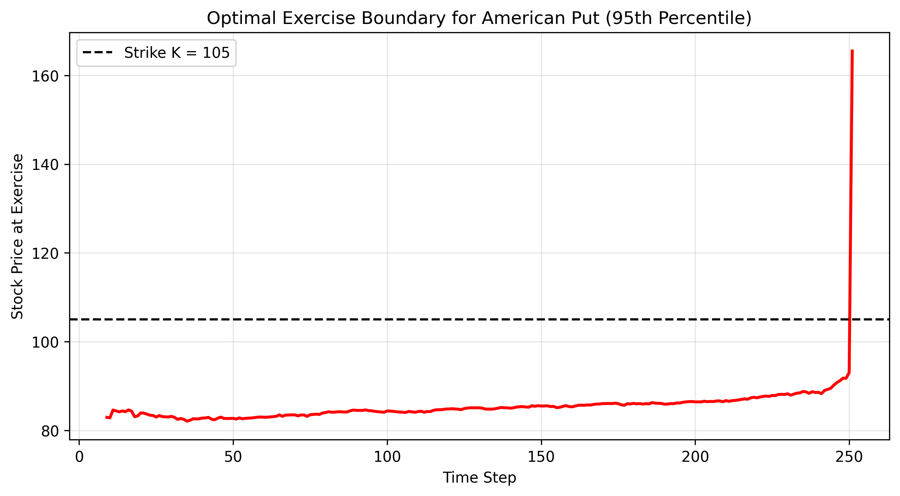
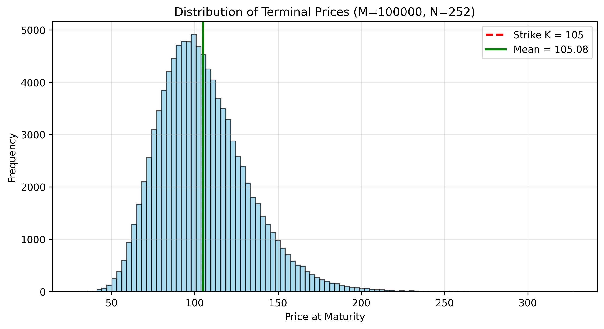
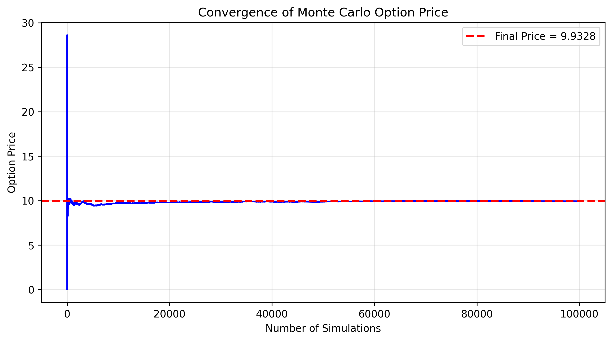

# American Option Pricing via Longstaff-Schwartz Monte Carlo

Implementation of the Longstaff-Schwartz (Least-Squares Monte Carlo) algorithm for pricing American put options.

## Overview

This project implements a Monte Carlo framework for pricing European and American options under the Geometric Brownian Motion (GBM) model. The core contribution is an implementation of the Longstaff-Schwartz (LSM) algorithm for American put options, which solves an optimal stopping problem through backward induction and least-squares regression.

## Core Algorithm

1. Simulate M price paths under risk-neutral GBM.
2. At each time step (from maturity backwards):
   - Compute intrinsic value: max(K - S_t, 0)
   - Filter in-the-money paths
   - Regress discounted future cashflow on [1, S_t, S_t^2] using OLS
   - Exercise if intrinsic > continuation value
3. Discount all cashflows back to t=0 and take the average.

## Results

### Optimal Exercise Boundary



The boundary separates the "exercise now" region (below the curve) from the "continue holding" region (above the curve).

### Terminal Price Distribution



Distribution of simulated terminal prices under risk-neutral GBM. The mean (green line) is close to the theoretical risk-neutral expectation `S0 * exp(rT)`.

### Monte Carlo Convergence



Convergence of the Monte Carlo option price as the number of simulations increases. The price stabilizes after approximately 20,000 paths.

## Project Structure

```
quant-projects/
├── Option_pricer.py       # OptionPricer class
├── main.py                # Main entry point
├── sensitivity.py         # Parameter sensitivity analysis
├── figures/               # Result images
├── .gitignore
└── README.md
```

## Getting Started

### Dependencies

```bash
pip install numpy matplotlib
```

### Run

```bash
python main.py
```

For sensitivity analysis:

```bash
python sensitivity.py
```

## Mathematical Background

### Risk-Neutral GBM

```
dS_t = r S_t dt + sigma S_t dW_t
```

Applying Ito's Lemma:

```
d(log S_t) = (r - 0.5 * sigma^2) dt + sigma dW_t
```

### Optimal Stopping

```
V_0 = sup_tau E[ exp(-r * tau) * max(K - S_tau, 0) ]
```

### Bellman Equation

```
V(t, S) = max( intrinsic(t, S), E[ exp(-r * dt) * V(t + dt, S_{t+dt}) ] )
```

## Author

Haokun Li  
BSc Mathematics & Statistics, King's College London  
haokun.2.li@kcl.ac.uk | linkedin.com/in/haokun-li-kcl | github.com/Lucas-Haokun
