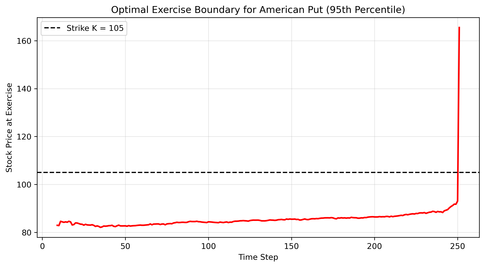

# American Option Pricing via Longstaff-Schwartz Monte Carlo

Python implementation of the Longstaff-Schwartz (Least-Squares Monte Carlo, LSM) algorithm for pricing American put options, validated against a binomial tree and the Black-Scholes closed form.

## Overview

This project implements a Monte Carlo framework for pricing European and American options under Geometric Brownian Motion (GBM). The core of the project is the LSM algorithm, which solves the optimal stopping problem for an American put by backward induction and least-squares regression, written from scratch with NumPy.

## Core Algorithm

1. Simulate M price paths under risk-neutral GBM.
2. At each time step, from maturity backwards:
   - Compute the intrinsic value: max(K - S_t, 0)
   - Select the in-the-money paths
   - Regress the discounted future cashflow on [1, S_t, S_t^2] using OLS to estimate the continuation value
   - Exercise if intrinsic value > continuation value
3. Discount all cashflows back to t = 0 and take the average.

## Results

Base case: S0 = 100, K = 105, r = 5%, sigma = 25%, T = 1 year, 252 time steps, 100,000 paths, seed = 42. Reproduce with `python validate.py`.

| Option | Monte Carlo | Benchmark | Error |
|---|---|---|---|
| European put | 9.8528 | 9.8813 (Black-Scholes) | 0.29% |
| American put (LSM) | 10.5803 | 10.6414 (CRR binomial tree, 5,000 steps) | 0.57% |

The American put is worth more than the European put because of the early exercise premium (about 0.76 in the CRR tree).

### Optimal Exercise Boundary



The boundary separates the "exercise now" region (below the curve) from the "continue holding" region (above the curve). It is plotted as the 95th percentile of stock prices at which the simulated paths exercise at each step, which is a practical estimate of the boundary rather than an exact solution.

### Sensitivity Analysis

American put price as one parameter is varied and the others are held at the base case (50,000 paths). Reproduce with `python sensitivity.py`.

| Volatility | Price | Strike | Price | Maturity (yrs) | Price | Risk-free rate | Price |
|---|---|---|---|---|---|---|---|
| 0.10 | 5.34 | 95 | 5.71 | 0.5 | 8.72 | 1% | 12.31 |
| 0.20 | 8.68 | 100 | 7.95 | 1.0 | 10.56 | 3% | 11.39 |
| 0.30 | 12.52 | 105 | 10.56 | 1.5 | 11.81 | 5% | 10.56 |
| 0.40 | 16.42 | 110 | 13.72 | 2.0 | 12.77 | 7% | 9.89 |

The price rises with volatility, strike and maturity, and falls as the risk-free rate rises, as expected for a put option.

## Project Structure

```
quant-projects/
├── Option_pricer.py       # OptionPricer class (simulation, European and LSM pricing, plots)
├── main.py                # Main entry point
├── sensitivity.py         # Parameter sensitivity analysis
├── validate.py            # Benchmarks: Black-Scholes and CRR binomial tree
├── figures/               # Result images (create this folder before running main.py)
├── .gitignore
└── README.md
```

## Getting Started

### Dependencies

```bash
pip install numpy matplotlib
```

### Run

```bash
mkdir -p figures
python main.py
```

For the validation against benchmarks:

```bash
python validate.py
```

For sensitivity analysis:

```bash
python sensitivity.py
```

## Mathematical Background

### Risk-Neutral GBM

```
dS_t = r S_t dt + sigma S_t dW_t
```

Applying Ito's Lemma:

```
d(log S_t) = (r - 0.5 * sigma^2) dt + sigma dW_t
```

### Optimal Stopping

```
V_0 = sup_tau E[ exp(-r * tau) * max(K - S_tau, 0) ]
```

### Bellman Equation

```
V(t, S) = max( intrinsic(t, S), E[ exp(-r * dt) * V(t + dt, S_{t+dt}) ] )
```

## Limitations

- The continuation value is estimated with a quadratic polynomial basis. A richer basis (for example cubic) can reduce the remaining bias in the LSM price.
- Time is discretised into 252 steps, so exercise is allowed only at those dates (a Bermudan approximation of the American option).
- LSM prices are estimates with Monte Carlo noise, which depends on the number of paths and the random seed.
- The exercise boundary plot is an empirical estimate from simulated paths, not an exact solution.

## Author

Haokun Li
BSc Mathematics & Statistics, King's College London
haokun.2.li@kcl.ac.uk | www.linkedin.com/in/haokun-li-kcl | github.com/Lucas-Haokun
